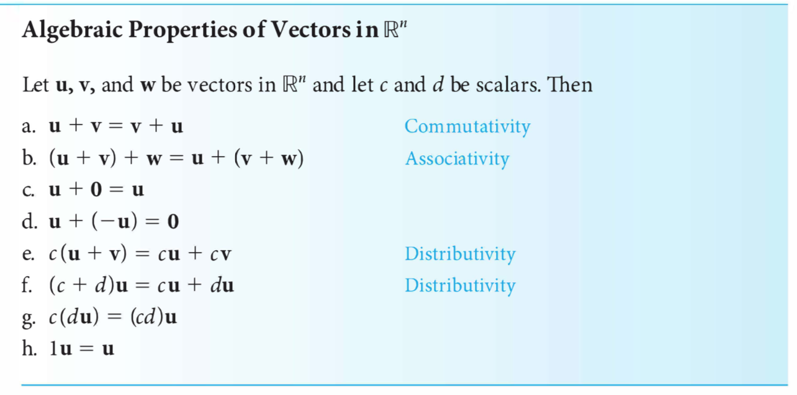
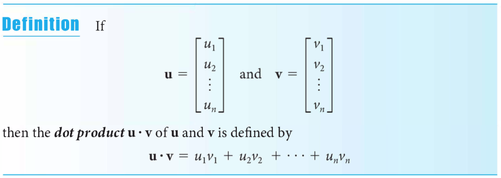
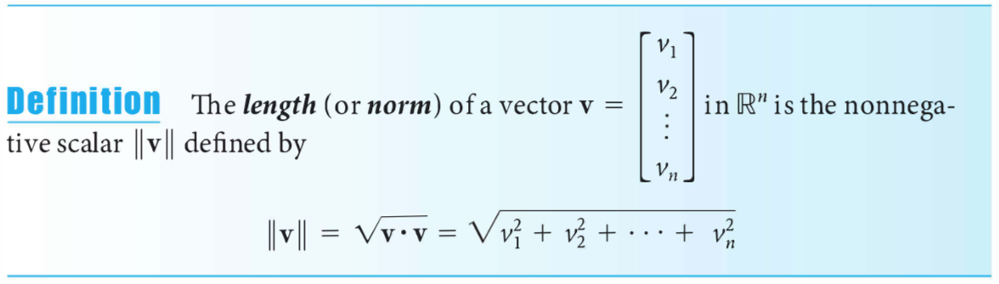
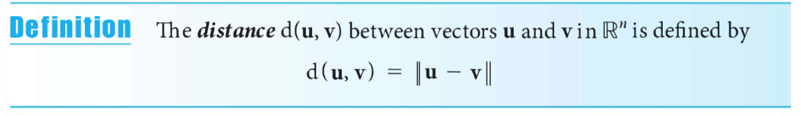
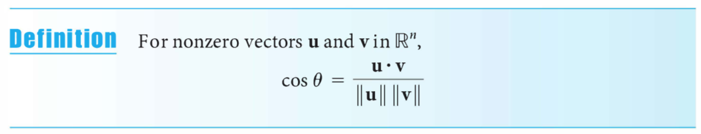
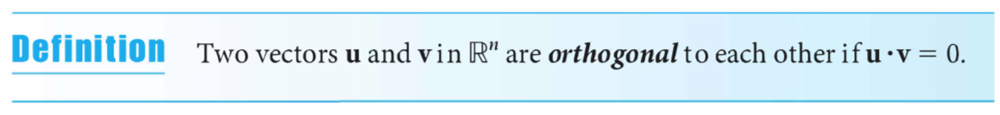
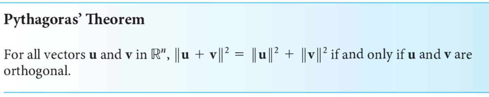
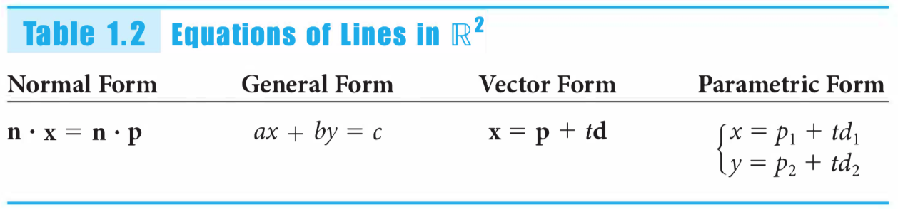
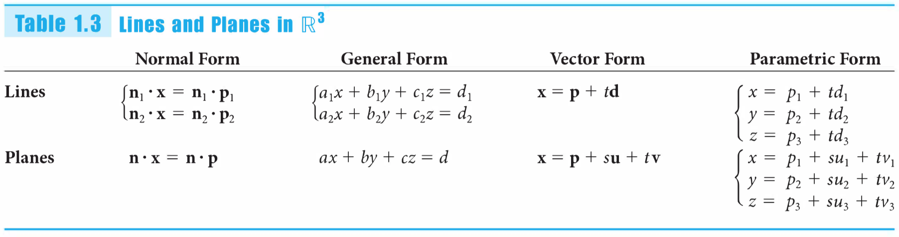

## Hoorcollege 1a (1.1, 1.2)
[1.1](#11)

[1.2](#12)

[1.3](#13)

### 1.1
Theorem 1.1 <- Algebra 	&#8477;n

### 1.2
Dot product:

Norm (length):

Distance:

Angle between vectors:

Orthigonal (hoek 90 graden):

Pythagoras:

(Orthogonal) Projection:

## Hoorcollege 1b (1.3, cross product)

### 1.3

<!--TABELLETJE van GEO COMP en ALG

| GEO | COMP | ALG |
| --- | --- | --- |
| bla | bla | bla |-->

n&sdot;x = &delta;

Normaal-vector is de vector loodrecht op de lijn/vlak

n&sdot;x = &delta;

In 3d: 
n&sdot;x = &delta; geeft of een punt boven of onder een vlak ligt

|||
|---|---|
|\> 0 | boven het vlak|
|= 0 | op het vlak|
|< 0 | onder het vlak|
