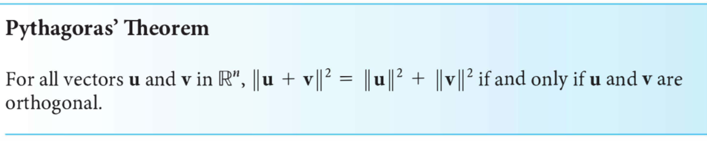
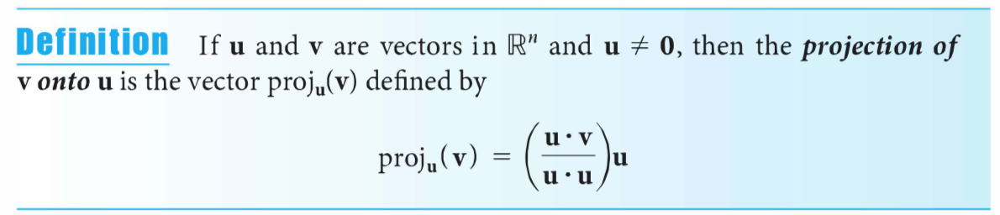

## Hoorcollege 1a

- [3blue1brown: Essence of linear algebra on Youtube](https://www.youtube.com/playlist?list=PLZHQObOWTQDPD3MizzM2xVFitgF8hE_ab)

### 1.1 The Geometry and Algebra of Vectors

Theorem 1.1 <- Algebra $\mathbb{R}^n$

### 1.2 Length and Angle: The Dot Product

Dot product:

Norm (length):

Distance:

Angle between vectors:

Orthogonaal (hoek 90 graden):

Pythagoras:

(Orthogonal) Projection:

## Hoorcollege 1b

### 1.3 Lines and Planes

$ \vec{n} \cdot \vec{x} = \delta $

Normaal-vector is de vector loodrecht op de lijn/vlak

$ \vec{n} \cdot \vec{x} = \delta $

#### Distance between plane and point

In 3d: 
$ \vec{n} \cdot \vec{x} = \delta $ geeft of een punt boven of onder een vlak ligt

|||
|---|---|
|$\> 0$ | boven het vlak|
|$= 0$ | op het vlak|
|$< 0$ | onder het vlak|

## Hoorcollege 2a

> RREF: Reduced Row-Echelon Form

span: de ruimte van vectoren die je kan maken van een set vectoren

### 2.1 Introduction to Systems of Linear Equations

### 2.2 Direct Methods for Solving Linear Systems

### 2.3 Spanning Sets and Linear Independence

Span:
De set van vectoren die je kan maken door een aantal andere vectoren te combineren

Een vector is lineair afhankelijk als deze uitgedrukt kan worden met 

## Hoorcollege 2b

### 3.1 Matrix Operations

### 3.6 Introduction to Linear Transformations

#### Types of (linear)transformations

Rotatie $\theta$ (tegen de klok in):

$T = \begin{bmatrix} 
\cos{\theta} & -\sin{\theta} \\\ 
\sin{\theta} & \cos{\theta} 
\end{bmatrix}$
$T^{-1} = \begin{bmatrix} 
\cos{\theta} & \sin{\theta} \\\ 
\-sin{\theta} & \cos{\theta} 
\end{bmatrix}$

## Hoorcollege 3a

### 3.2 Matrix Algebra

$\frac{d \cdot d^T}{d^T \cdot d} \cdot v$

### 3.3 The Inverse of a Matrix

## Hoorcollge 3b

### 3.5: Subspace, Basis, Dimension and Rank

#### Linear Subspaces (Deelruimte)

In 2D:

0-D a) $\vec{o}$ punt in de oorsprong  
1-D b) Een lijn door $\vec{o}$  
2-D c) Hele vlak

$row(A) = col(A^T)$ $(row(A))^T = col(A^T)$  
col space, de ruimte van mogelijke uitkomsten

Alle vectoren die op $\vec{o}$ terechtkomen

##### Subspace of Transformation

Bij rotatie veranderd de subspace niet

#### Basis

Minimaal aantal vectoren die je nodig hebt om een subspace op te spannen en maximaal onafhankelijk

#### Dimension

Het aantal vectoren in de Basis van een subspace

#### Null space or Kernel (NL: nulruimte of kern)

$null(A):$ deelruimte opgespannen door alle $\vec{x}$ waarvoor $A\vec{x}=0$

#### Rank

$rank(A):$ dimensie $col(A)$

#### Nullity

De dimension van de nulruimte
$nullity(A):$ dimensie van $null(A)$

$A =m \times n$, dan geldt:  
$rank(A) + nullity(A) = n$

## Acknowledgements

Pictures © David Poole, Linear Algebra - A Modern Introduction (*Fourth edition*)

