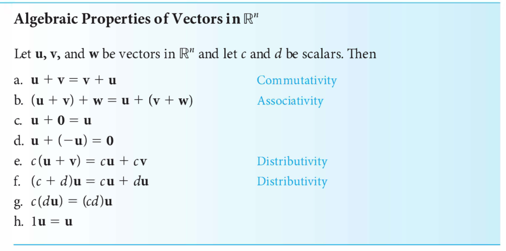
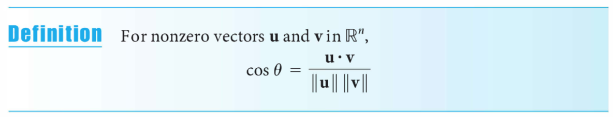
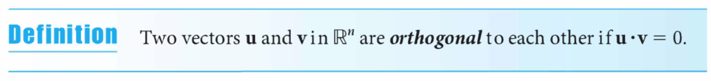
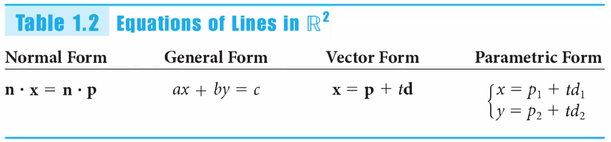

# LinAlg

## Hoorcollege 1a (1.1, 1.2)

- [3blue1brown: Essence of linear algebra on Youtube](https://www.youtube.com/playlist?list=PLZHQObOWTQDPD3MizzM2xVFitgF8hE_ab)

### 1.1 The Geometry and Algebra of Vectors

Theorem 1.1 <- Algebra 	&#8477;n

### 1.2 Length and Angle: The Dot Product

Dot product:

Norm (length):

Distance:

Angle between vectors:

Orthogonaal (hoek 90 graden):

Pythagoras:

(Orthogonal) Projection:

## Hoorcollege 1b (1.3, cross product)

### 1.3 Lines and Planes

<!--TABELLETJE van GEO COMP en ALG

| GEO | COMP | ALG |
| --- | --- | --- |
| bla | bla | bla |-->

n&sdot;x = &delta;

Normaal-vector is de vector loodrecht op de lijn/vlak

n&sdot;x = &delta;

#### Distance between plane and point

In 3d: 
n&sdot;x = &delta; geeft of een punt boven of onder een vlak ligt

|||
|---|---|
|\> 0 | boven het vlak|
|= 0 | op het vlak|
|< 0 | onder het vlak|

## Hoorcollege 2a

> RREF: Reduced Row-Echelon Form

span: de ruimte van vectoren die je kan maken van een set vectoren

### 2.1 Introduction to Systems of Linear Equations

### 2.2 Direct Methods for Solving Linear Systems

### 2.3 Spanning Sets and Linear Independence

Span:

## Hoorcollege 2b

### 3.1 Matrix Operations

### 3.6 Introduction to Linear Transformations

#### Types of (linear)transformations

